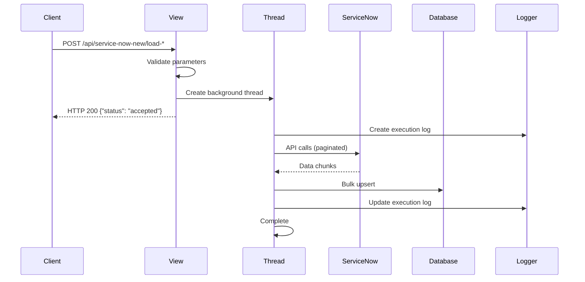

# APIs e Views

## Visão Geral

O módulo `api_service_now_new` expõe duas APIs REST principais para integração com o ServiceNow. Ambas implementam processamento assíncrono usando threads nativas do Python para evitar timeouts HTTP e melhorar a experiência do usuário.

## Arquitetura das Views

### Padrão de Execução Assíncrona



### Características Comuns

- **Resposta Imediata**: Cliente recebe confirmação em milissegundos
- **Thread Daemon**: Não bloqueia shutdown da aplicação
- **Logging Detalhado**: Cada execução é auditada
- **Tratamento de Erros**: Falhas são capturadas e registradas
- **Paralelização**: Tasks executam em paralelo quando possível

## LoadIncidentsView

### Endpoint

```http
POST /api/service-now-new/load-incidents/
Content-Type: application/json

{
  "data_inicio": "2025-01-20",
  "data_fim": "2025-01-20"
}
```

### Parâmetros

| Parâmetro | Tipo | Obrigatório | Descrição |
|-----------|------|-------------|-----------|
| `data_inicio` | string | Não | Data de início (YYYY-MM-DD). Padrão: ontem |
| `data_fim` | string | Não | Data de fim (YYYY-MM-DD). Padrão: ontem |

### Resposta

```json
{
  "status": "accepted",
  "message": "Processing started in background"
}
```

### Funcionalidade

Carrega dados relacionados a incidents do ServiceNow no período especificado:

1. **Incidents Abertos**: Busca por `opened_at` no período
2. **SLAs**: Carrega SLAs dos incidents
3. **Tasks**: Carrega tasks relacionadas aos incidents
4. **Time Worked**: Registros de tempo trabalhado

### Fluxo de Execução

```python
def post(self, request, *args, **kwargs) -> Response:
    # 1. Parse de parâmetros com fallback para ontem
    data_inicio = request.data.get("data_inicio")
    data_fim = request.data.get("data_fim")
    if not data_inicio or not data_fim:
        ontem = (datetime.datetime.now() - datetime.timedelta(days=1)).date()
        data_inicio = data_inicio or ontem.strftime("%Y-%m-%d")
        data_fim = data_fim or ontem.strftime("%Y-%m-%d")
    
    # 2. Patch SSL e criação da thread
    patch_requests_ssl()
    thread = threading.Thread(
        target=self._run_pipelines_in_background,
        args=(data_inicio, data_fim),
        daemon=True,
    )
    thread.start()
    
    # 3. Resposta imediata
    return Response({
        "status": "accepted", 
        "message": "Processing started in background"
    })
```

### Tasks Executadas (Paralelo)

```python
heavy_tasks = [
    ("load_incidents_opened", LoadIncidentsOpened),
    ("load_incident_sla", LoadIncidentSla), 
    ("load_task_time_worked", LoadTaskTimeWorked),
    ("load_incident_task", LoadIncidentTask),
]

# Execução em paralelo
threads = []
for name, cls in heavy_tasks:
    th = threading.Thread(target=_run_task_local, args=(name, cls), daemon=True)
    th.start()
    threads.append(th)

# Aguarda todas as threads
for th in threads:
    th.join()
```

### Exemplo de Uso

```bash
# Carregar incidents de hoje
curl -X POST http://localhost:8000/api/service-now-new/load-incidents/ \
  -H "Content-Type: application/json" \
  -d '{"data_inicio": "2025-01-20", "data_fim": "2025-01-20"}'

# Resposta imediata
{
  "status": "accepted",
  "message": "Processing started in background" 
}
```

## LoadConfigurationsView

### Endpoint

```http
POST /api/service-now-new/load-configurations/
Content-Type: application/json

{
  "data_inicio": "2025-01-20",
  "data_fim": "2025-01-20"
}
```

### Parâmetros

| Parâmetro | Tipo | Obrigatório | Descrição |
|-----------|------|-------------|-----------|
| `data_inicio` | string | Não | Data de início (compatibilidade) |
| `data_fim` | string | Não | Data de fim (compatibilidade) |

> **Nota**: As tasks de configuração não utilizam filtros por data, mas os parâmetros são mantidos para compatibilidade.

### Resposta

```json
{
  "status": "accepted", 
  "message": "Processing started in background"
}
```

### Funcionalidade

Carrega dados de configuração do ServiceNow que raramente mudam:

1. **Contratos SLA**: Definições de SLA
2. **Grupos**: Grupos de atribuição 
3. **Empresas**: Cadastro de empresas
4. **Usuários**: Cadastro de usuários
5. **Links CMDB**: Links de rede do CMDB

### Estratégia de Paralelização

```python
# Limita a 3 threads simultâneas para evitar sobrecarga
max_threads = 3

# Executa em lotes
for i in range(0, len(tasks_to_run), max_threads):
    batch = tasks_to_run[i : i + max_threads]
    threads = []
    for name, cls in batch:
        th = threading.Thread(
            target=self._run_task,
            args=(name, cls, results, errors),
            daemon=True,
        )
        th.start()
        threads.append(th)
    # Aguarda o lote atual
    for th in threads:
        th.join()
```

### Tasks Executadas (Lotes de 3)

**Lote 1:**
- `LoadContractSla`
- `LoadGroups` 
- `LoadSysCompany`

**Lote 2:**
- `LoadSysUser`
- `LoadCmdbCiNetworkLink`

### Exemplo de Uso

```bash
# Atualizar configurações
curl -X POST http://localhost:8000/api/service-now-new/load-configurations/ \
  -H "Content-Type: application/json" \
  -d '{}'

# Resposta imediata
{
  "status": "accepted",
  "message": "Processing started in background"
}
```

## Tratamento de Erros

### Captura por Task

Cada task é executada em um try/catch isolado:

```python
def _run_task(self, task_name, task_cls, start_date, end_date, results, errors):
    try:
        print(f"[Incidents] Executando tarefa: {task_name}")
        t0 = datetime.datetime.now()
        
        # Tenta com parâmetros de data
        try:
            with task_cls(start_date=start_date, end_date=end_date) as load:
                r = load.run()
        except TypeError:
            # Fallback para tasks sem parâmetros de data
            with task_cls() as load:
                r = load.run()
                
        results[task_name] = r
        logger.info("%s finished: %s", task_name, r)
        
    except Exception as e:
        logger.exception("Erro na task %s", task_name)
        errors.append((task_name, str(e)))
```

### Agregação de Erros

Erros são coletados e salvos no log de execução:

```python
# Lista de erros por task
errors = []

# Ao final da execução
exec_log.status = "error" if errors else "success"
exec_log.error_message = "; ".join(e for _, e in errors)[:1000] if errors else None
```

## Monitoramento

### ServiceNowExecutionLog

Cada execução gera um registro detalhado:

```python
exec_log = ServiceNowExecutionLog.objects.create(
    execution_type="incidents",  # ou "configurations"
    start_date=sd,
    end_date=ed, 
    started_at=started_at,
    status="running",
)

# Ao final
exec_log.ended_at = datetime.datetime.now()
exec_log.duration_seconds = round(total.total_seconds(), 2)
exec_log.status = "error" if errors else "success"
exec_log.save()
```

### Métricas Disponíveis

- **Duração**: Tempo total de execução
- **Status**: Sucesso ou erro
- **Registros**: Quantidade processada
- **Erros**: Detalhes de falhas
- **Timestamp**: Quando foi executado

### Consulta de Logs

```python
# Últimas execuções de incidents
recent_incidents = ServiceNowExecutionLog.objects.filter(
    execution_type='incidents'
).order_by('-started_at')[:10]

# Taxa de sucesso
success_rate = ServiceNowExecutionLog.objects.filter(
    status='success'
).count() / ServiceNowExecutionLog.objects.count()
```

## Performance

### Otimizações Implementadas

1. **SSL Patch**: `patch_requests_ssl()` para compatibilidade Meraki
2. **Thread Daemon**: Não bloqueia shutdown da aplicação
3. **Paralelização**: Multiple tasks simultâneas
4. **Bulk Operations**: Inserções em lote no banco
5. **Logging Assíncrono**: Não bloqueia processamento

### Limitações de Concorrência

- **LoadIncidentsView**: 4 threads simultâneas
- **LoadConfigurationsView**: 3 threads por lote
- **Memória**: Polars DataFrames em memória
- **API Rate Limit**: ServiceNow pode limitar requisições

### Recomendações

1. **Horário**: Executar fora do horário de pico
2. **Período**: Evitar intervalos muito grandes (> 30 dias)
3. **Monitoramento**: Acompanhar logs de execução
4. **Retry**: Re-executar em caso de falha parcial

## Segurança

### Autenticação

Views não implementam autenticação própria, dependendo da configuração do Django:

```python
# Em settings.py
REST_FRAMEWORK = {
    'DEFAULT_AUTHENTICATION_CLASSES': [
        'rest_framework.authentication.TokenAuthentication',
    ],
    'DEFAULT_PERMISSION_CLASSES': [
        'rest_framework.permissions.IsAuthenticated',
    ],
}
```

### Credenciais ServiceNow

Obtidas via variáveis de ambiente:

```python
base_url = os.getenv("SERVICE_NOW_BASE_URL")
user = os.getenv("SERVICE_NOW_USERNAME") 
password = os.getenv("SERVICE_NOW_USER_PASSWORD")
```

### Validação de Entrada

```python
# Parse seguro de datas
try:
    sd = datetime.datetime.strptime(start_date, "%Y-%m-%d").date()
except Exception:
    sd = None  # Fallback graceful
```

## Extensibilidade

### Adicionando Nova Task

1. Criar classe herdando de `Pipeline`
2. Adicionar ao `__init__.py` do módulo tasks
3. Incluir na lista de tasks da view apropriada
4. Atualizar documentação

### Nova View

```python
class LoadCustomView(APIView):
    def post(self, request, *args, **kwargs) -> Response:
        # Parse parâmetros
        thread = threading.Thread(
            target=self._run_pipelines_in_background,
            args=(...),
            daemon=True,
        )
        thread.start()
        return Response({"status": "accepted"})
        
    def _run_pipelines_in_background(self, ...):
        # Lógica de execução
        exec_log = ServiceNowExecutionLog.objects.create(...)
        # ... execução das tasks
        exec_log.save()
```