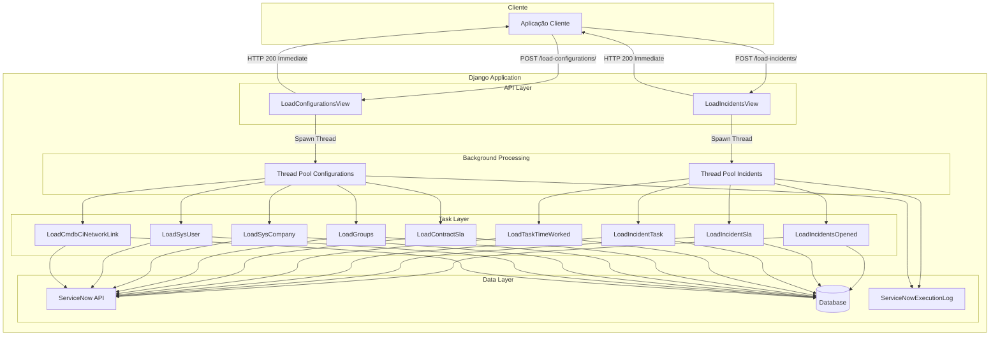
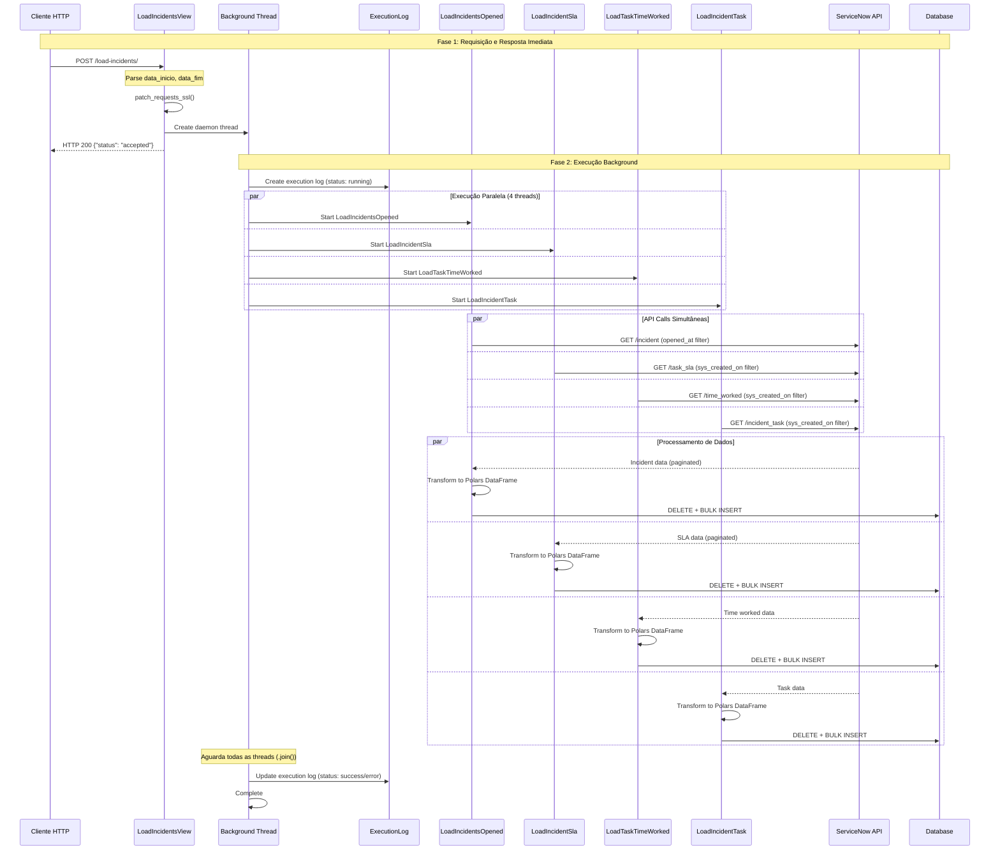
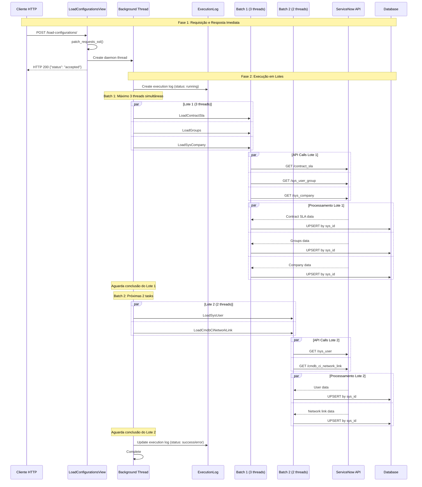
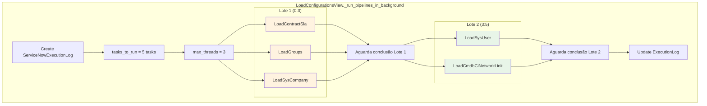
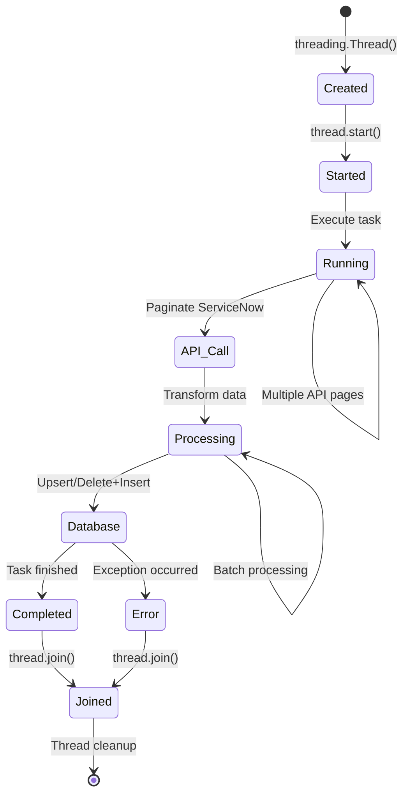
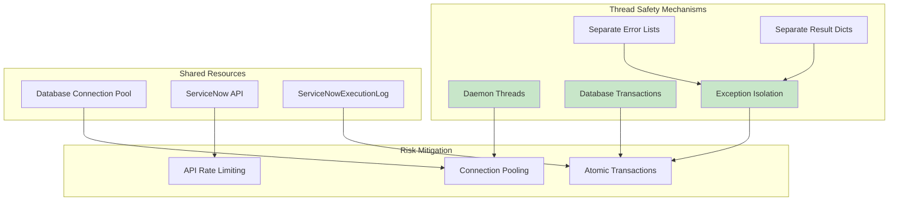
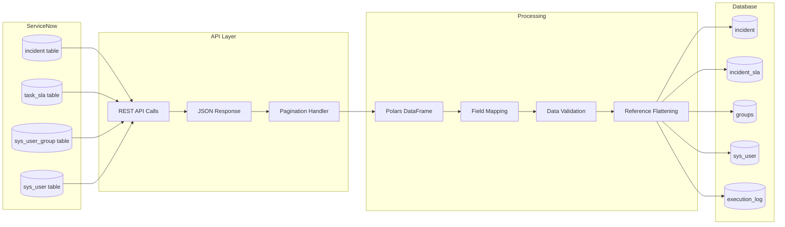
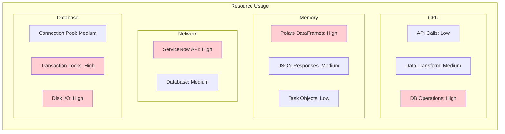
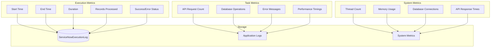

# Diagramas de Arquitetura

## Visão Geral

Esta seção apresenta diagramas detalhados da arquitetura do sistema `api_service_now_new`, mostrando como funcionam as atualizações das duas views principais e o disparo das threads.

## Arquitetura Geral do Sistema



## Fluxo LoadIncidentsView

### Sequência Completa



### Detalhamento do Threading

```mermaid
graph TD
    subgraph "LoadIncidentsView._run_pipelines_in_background"
        A[Create ServiceNowExecutionLog]
        
        subgraph "Parallel Execution Block"
            B[Create Thread 1: LoadIncidentsOpened]
            C[Create Thread 2: LoadIncidentSla]
            D[Create Thread 3: LoadTaskTimeWorked] 
            E[Create Thread 4: LoadIncidentTask]
        end
        
        F[thread.start() for all threads]
        G[thread.join() for all threads]
        H[Update ExecutionLog with results]
    end
    
    A --> B
    A --> C
    A --> D
    A --> E
    
    B --> F
    C --> F
    D --> F
    E --> F
    
    F --> G
    G --> H
    
    style B fill:#e1f5fe
    style C fill:#e1f5fe
    style D fill:#e1f5fe
    style E fill:#e1f5fe
```

## Fluxo LoadConfigurationsView

### Sequência Completa



### Estratégia de Lotes



## Gerenciamento de Threads

### Thread Lifecycle



### Thread Safety



## Pipeline de Dados

### ETL Flow per Task

```mermaid
flowchart TD
    subgraph "Extract Phase"
        A[Build ServiceNow Query]
        B[Get Field List from Model]
        C[Call paginate() function]
        D[Handle API Pagination]
        E[Collect All Records]
    end
    
    subgraph "Transform Phase" 
        F[Create Polars DataFrame]
        G[Flatten Reference Fields]
        H[Normalize Empty Strings to None]
        I[Add ETL Timestamps]
    end
    
    subgraph "Load Phase"
        J{Load Strategy}
        K[DELETE + INSERT<br/>Incidents Tasks]
        L[UPSERT by sys_id<br/>Configuration Tasks]
        M[Bulk Database Operations]
        N[Update Log Metrics]
    end
    
    A --> B
    B --> C
    C --> D
    D --> E
    E --> F
    F --> G
    G --> H
    H --> I
    I --> J
    J --> K
    J --> L
    K --> M
    L --> M
    M --> N
    
    style F fill:#e3f2fd
    style M fill:#f3e5f5
```

### Data Flow Diagram



## Tratamento de Erros

### Error Handling Flow

```mermaid
flowchart TD
    subgraph "Task Level Errors"
        A[Task Execution Start]
        B{API Call Success?}
        C{Data Processing OK?}
        D{Database Save OK?}
        E[Task Success]
        F[Log Error in errors[] list]
        G[Continue Other Tasks]
    end
    
    subgraph "Thread Level Errors"  
        H[Aggregate All Task Results]
        I{Any Errors?}
        J[execution_log.status = 'success']
        K[execution_log.status = 'error']
        L[Save error_message]
    end
    
    A --> B
    B -->|No| F
    B -->|Yes| C
    C -->|No| F  
    C -->|Yes| D
    D -->|No| F
    D -->|Yes| E
    
    F --> G
    E --> G
    G --> H
    
    H --> I
    I -->|No| J
    I -->|Yes| K
    K --> L
    
    style F fill:#ffcdd2
    style K fill:#ffcdd2
    style L fill:#ffcdd2
```

### Exception Isolation

```mermaid
graph TB
    subgraph "Main Thread"
        A[LoadIncidentsView.post()]
        B[Create Background Thread]
        C[Return HTTP 200]
    end
    
    subgraph "Background Thread"
        D[_run_pipelines_in_background]
        
        subgraph "Task Thread 1"
            E[LoadIncidentsOpened]
            F{Exception?}
            G[Add to errors[]]
        end
        
        subgraph "Task Thread 2"
            H[LoadIncidentSla]
            I{Exception?}
            J[Add to errors[]]
        end
        
        K[Collect All Results]
        L[Update ExecutionLog]
    end
    
    A --> B
    B --> C
    B --> D
    
    D --> E
    D --> H
    
    E --> F
    F -->|Yes| G
    H --> I  
    I -->|Yes| J
    
    G --> K
    J --> K
    K --> L
    
    style F fill:#ffab91
    style I fill:#ffab91
    style G fill:#ffcdd2
    style J fill:#ffcdd2
```

## Performance Characteristics

### Timing Diagram

```mermaid
gantt
    title Execution Timeline - LoadIncidentsView
    dateFormat X
    axisFormat %s
    
    section Main Thread
    HTTP Request Processing    :0, 1
    Create Background Thread   :1, 2
    Return HTTP 200           :2, 3
    
    section Background Thread
    Create ExecutionLog       :3, 5
    Spawn Parallel Tasks      :5, 7
    Wait for Completion       :7, 180
    Update ExecutionLog       :180, 185
    
    section Task Threads
    LoadIncidentsOpened       :7, 120
    LoadIncidentSla          :7, 150
    LoadTaskTimeWorked       :7, 90
    LoadIncidentTask         :7, 110
    
    section Database Operations
    Delete Old Records       :20, 25
    Bulk Insert New Records  :25, 60
    Update Execution Log     :180, 185
```



### Resource Utilization



## Monitoramento e Observabilidade

### Metrics Collection



Esta documentação fornece uma visão completa de como o sistema funciona, incluindo todos os diagramas detalhados da arquitetura, fluxo das views e gerenciamento de threads conforme solicitado.