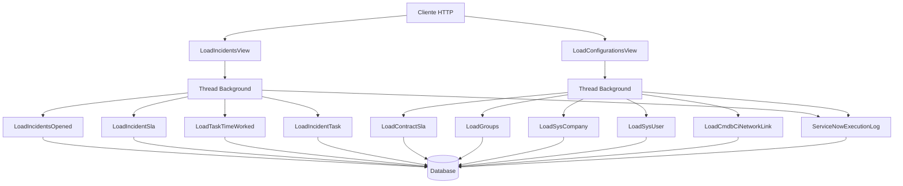

# API ServiceNow New

## Visão Geral

O módulo `api_service_now_new` é uma implementação modernizada para integração com a API do ServiceNow, focada em extrair e processar dados de incidents e configurações do sistema. Esta versão substitui implementações anteriores, oferecendo melhor performance, gestão de threads e logging detalhado.

## Características Principais

- **Processamento Assíncrono**: Utiliza threads Python nativas ao invés do Celery para evitar problemas de broken pipe
- **Paralelização Controlada**: Execução simultânea de múltiplas tasks com limitação de threads concorrentes
- **Logging Detalhado**: Sistema completo de auditoria com métricas de performance
- **Upsert Inteligente**: Atualização/inserção de dados baseada em `sys_id` do ServiceNow
- **Tratamento de Referências**: Conversão automática de campos de referência do ServiceNow

## Arquitetura do Sistema

### Componentes Principais



### Fluxo de Execução

1. **Recepção da Requisição**: Views recebem POST com parâmetros de data
2. **Criação de Thread**: Processamento é delegado para thread background
3. **Resposta Imediata**: Cliente recebe confirmação de processamento iniciado
4. **Execução Paralela**: Tasks são executadas em lotes com controle de concorrência
5. **Logging**: Todo o processo é auditado no `ServiceNowExecutionLog`

## Views Principais

### LoadIncidentsView

**Endpoint**: `POST /api/service-now-new/load-incidents/`

**Funcionalidade**: Carrega dados relacionados a incidents do ServiceNow

**Parâmetros**:
- `data_inicio` (string): Data de início no formato YYYY-MM-DD
- `data_fim` (string): Data de fim no formato YYYY-MM-DD

**Tasks Executadas (em paralelo)**:
- `LoadIncidentsOpened`: Incidents abertos no período
- `LoadIncidentSla`: SLAs dos incidents
- `LoadTaskTimeWorked`: Tempo trabalhado nas tasks
- `LoadIncidentTask`: Tasks relacionadas aos incidents

### LoadConfigurationsView

**Endpoint**: `POST /api/service-now-new/load-configurations/`

**Funcionalidade**: Carrega dados de configuração do ServiceNow

**Parâmetros**:
- `data_inicio` (string): Data de início (compatibilidade)
- `data_fim` (string): Data de fim (compatibilidade)

**Tasks Executadas (em lotes de 3)**:
- `LoadContractSla`: Contratos SLA
- `LoadGroups`: Grupos do sistema
- `LoadSysCompany`: Empresas
- `LoadSysUser`: Usuários
- `LoadCmdbCiNetworkLink`: Links de rede CMDB

## Gerenciamento de Threads

### Estratégia de LoadIncidentsView

```python
# Execução paralela de 4 tasks pesadas
heavy_tasks = [
    ("load_incidents_opened", LoadIncidentsOpened),
    ("load_incident_sla", LoadIncidentSla), 
    ("load_task_time_worked", LoadTaskTimeWorked),
    ("load_incident_task", LoadIncidentTask),
]

# Cria e executa threads em paralelo
threads = []
for name, cls in heavy_tasks:
    th = threading.Thread(target=_run_task_local, args=(name, cls), daemon=True)
    th.start()
    threads.append(th)

# Aguarda conclusão de todas
for th in threads:
    th.join()
```

### Estratégia de LoadConfigurationsView

```python
# Limita execução a 3 threads simultâneas
max_threads = 3

# Executa em lotes
for i in range(0, len(tasks_to_run), max_threads):
    batch = tasks_to_run[i : i + max_threads]
    threads = []
    for name, cls in batch:
        th = threading.Thread(target=self._run_task, args=(name, cls, results, errors), daemon=True)
        th.start()
        threads.append(th)
    for th in threads:
        th.join()
```

## Sistema de Logging

### ServiceNowExecutionLog

Cada execução é registrada com as seguintes informações:

- **Identificação**: `execution_type` (incidents/configurations)
- **Período**: `start_date`, `end_date`
- **Temporização**: `started_at`, `ended_at`, `duration_seconds`
- **Status**: `status` (running/success/error)
- **Métricas**: Contadores de API, DB, registros processados
- **Erros**: `error_message` com detalhes de falhas

### Exemplo de Log

```json
{
  "execution_type": "incidents",
  "start_date": "2025-01-20",
  "end_date": "2025-01-20", 
  "started_at": "2025-01-20T10:00:00Z",
  "ended_at": "2025-01-20T10:15:30Z",
  "duration_seconds": 930.45,
  "status": "success",
  "total_records_processed": 1250,
  "error_message": null
}
```

## Estrutura de Dados

### Pipeline Base

Todas as tasks herdam de `Pipeline` e `MixinGetDataset`, fornecendo:

- **Extração**: Conexão paginada com API ServiceNow
- **Transformação**: Normalização de campos e referências
- **Carregamento**: Upsert baseado em `sys_id`

### Polars DataFrame

Utiliza Polars para processamento eficiente de grandes datasets:

```python
@property
def _incidents(self) -> pl.DataFrame:
    result_list = paginate(path="incident", params=params, ...)
    return pl.DataFrame(result_list, schema={f.name: pl.String for f in Incident._meta.fields})
```

## Tratamento de Erros

### Estratégias Implementadas

1. **Thread Daemon**: Threads marcadas como daemon para não bloquear shutdown
2. **Exception Handling**: Captura de erros individuais por task
3. **Agregação de Erros**: Lista consolidada de falhas
4. **Logging Detalhado**: Stack traces completos no logger
5. **Graceful Degradation**: Falha de uma task não interrompe outras

### Exemplo de Tratamento

```python
try:
    with task_cls(start_date=start_date, end_date=end_date) as load:
        r = load.run()
    results[task_name] = r
    logger.info("%s finished: %s", task_name, r)
except Exception as e:
    logger.exception("Erro na task %s", task_name)
    errors.append((task_name, str(e)))
```

## Performance e Otimizações

### Paginação Inteligente

- Chunks de 10.000 registros por página
- Offset-based pagination para ServiceNow
- Processamento streaming para grandes volumes

### Bulk Operations

- `bulk_create` para inserções em lote
- `bulk_update` com fallback individual
- Batch size de 1.000 registros

### Conexão HTTP

- Reutilização de conexões
- Timeout configurável
- SSL patch para Meraki compatibility

## Próximos Passos

1. **Implementar cursor-based pagination** para APIs que suportam
2. **Adicionar retry mechanism** com backoff exponencial  
3. **Implementar rate limiting** para respeitar limites da API
4. **Adicionar compressão** para reduzir tráfego de rede
5. **Melhorar métricas** com mais detalhamento por task

## Links Relacionados

- [Modelos de Dados](models/index.md)
- [APIs e Views](api/index.md) 
- [Tasks](tasks/index.md)
- [Utilitários](utils/index.md)
- [Diagramas de Arquitetura](architecture/index.md)