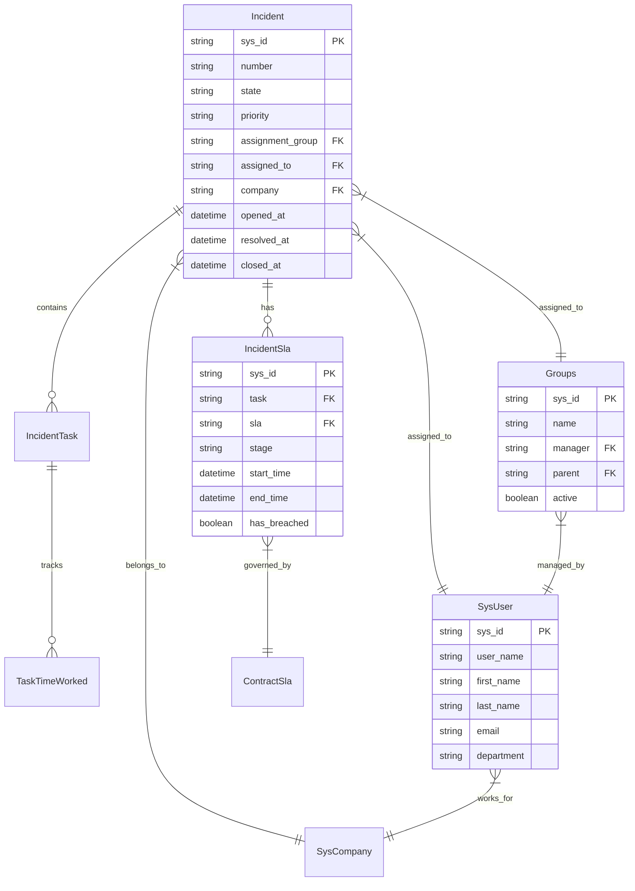

# Modelos de Dados

## Visão Geral

O módulo `api_service_now_new` define modelos de dados que espelham as estruturas do ServiceNow, mantendo compatibilidade total com as tabelas existentes no sistema. Todos os modelos seguem um padrão consistente de design e auditoria.

## Características Gerais

### Padrões de Design

- **Primary Key**: Todos os modelos usam `sys_id` como chave primária (TextField)
- **Collation**: Uso consistente de `SQL_Latin1_General_CP1_CI_AS`
- **Campos Opcionais**: Todos os campos (exceto PK) são `null=True, blank=True`
- **Auditoria ETL**: Campos `etl_created_at` e `etl_updated_at` automáticos
- **Unmanaged**: Tabelas não são gerenciadas pelo Django (`managed = False`)

### Campos de Auditoria

Todos os modelos incluem:

```python
etl_created_at = models.DateTimeField(auto_now_add=True, null=True, blank=True)
etl_updated_at = models.DateTimeField(auto_now=True, null=True, blank=True)
```

### Tratamento de Referências

Campos de referência do ServiceNow são expandidos com campos `dv_` (display value):

```python
# Campo de referência
manager = models.TextField(null=True, blank=True, db_collation=COLLATION)
# Campo display value correspondente
dv_manager = models.TextField(null=True, blank=True, db_collation=COLLATION)
```

## Modelos Principais

### Incident

**Tabela**: `incident`
**Descrição**: Registros de incidents do ServiceNow

**Campos Principais**:
- `sys_id`: Identificador único (PK)
- `number`: Número do incident (ex: INC0000123)
- `state` / `incident_state`: Estado do incident
- `priority`, `urgency`, `impact`, `severity`: Classificações
- `category`, `subcategory`, `u_subcategory_detail`: Categorização
- `short_description`, `description`: Descrições
- `opened_at`, `resolved_at`, `closed_at`: Timestamps importantes
- `assignment_group`, `assigned_to`: Atribuições
- `caller_id`, `opened_by`, `resolved_by`, `closed_by`: Pessoas envolvidas

**Uso**: Tabela central para análise de incidents, relacionada com SLAs e tasks

### IncidentSla

**Tabela**: `incident_sla` 
**Descrição**: SLAs associados aos incidents

**Campos Principais**:
- `task`: Referência ao incident
- `sla`: Referência ao contrato SLA
- `stage`: Estágio atual do SLA
- `start_time`, `end_time`: Período de vigência
- `has_breached`: Indicador de violação
- `business_percentage`: Percentual de cumprimento

### IncidentTask

**Tabela**: `incident_task`
**Descrição**: Tasks relacionadas aos incidents

**Campos Principais**:
- `parent`: Referência ao incident pai
- `number`: Número da task
- `state`, `active`: Status da task
- `short_description`, `description`: Descrições
- `assigned_to`, `assignment_group`: Atribuições

### TaskTimeWorked

**Tabela**: `task_time_worked`
**Descrição**: Tempo trabalhado nas tasks

**Campos Principais**:
- `task`: Referência à task
- `time_spent`: Tempo gasto
- `work_start`, `work_end`: Período de trabalho
- `created_by`: Quem registrou o tempo

### Groups

**Tabela**: `groups`
**Descrição**: Grupos de atribuição do ServiceNow

**Campos Principais**:
- `name`: Nome do grupo
- `description`: Descrição do grupo
- `manager`: Gerente do grupo
- `active`: Status ativo
- `parent`: Grupo pai (hierarquia)
- `u_product`, `u_product_family`: Classificação por produto

### SysCompany

**Tabela**: `sys_company`
**Descrição**: Empresas cadastradas no ServiceNow

**Campos Principais**:
- `name`: Nome da empresa
- `country`: País
- `city`, `state`, `zip`: Localização
- `phone`, `email`: Contatos
- `website`: Site da empresa

### SysUser

**Tabela**: `sys_user`
**Descrição**: Usuários do sistema ServiceNow

**Campos Principais**:
- `user_name`: Nome de usuário
- `first_name`, `last_name`: Nome completo
- `email`: Email
- `active`: Status ativo
- `department`: Departamento
- `location`: Localização
- `manager`: Gerente

### ContractSla

**Tabela**: `contract_sla`
**Descrição**: Contratos de SLA configurados

**Campos Principais**:
- `name`: Nome do SLA
- `description`: Descrição
- `duration`: Duração
- `schedule`: Cronograma
- `start_condition`, `stop_condition`: Condições

### CmdbCiNetworkLink

**Tabela**: `cmdb_ci_network_link`
**Descrição**: Links de rede no CMDB

**Campos Principais**:
- `name`: Nome do link
- `operational_status`: Status operacional
- `u_bandwidth`: Largura de banda
- `u_circuit_id`: ID do circuito

### ServiceNowExecutionLog

**Tabela**: `servicenow_execution_log`
**Descrição**: Log de execuções das integrações

**Campos Principais**:
- `execution_type`: Tipo (incidents/configurations)
- `start_date`, `end_date`: Período processado
- `started_at`, `ended_at`: Timestamps de execução
- `duration_seconds`: Duração em segundos
- `status`: Status (running/success/error)
- `total_records_processed`: Total de registros
- `error_message`: Mensagem de erro (se houver)

## Diagrama de Relacionamentos



## Estratégias de ETL

### Upsert por sys_id

Todos os modelos implementam upsert baseado em `sys_id`:

```python
@transaction.atomic
def upsert_by_sys_id(dataset: pl.DataFrame, model, log: Dict = None) -> None:
    # 1. Identifica registros existentes
    existing = {o.sys_id: o for o in model.objects.filter(sys_id__in=[r["sys_id"] for r in processed])}
    
    # 2. Separa em inserções e atualizações
    to_create = []
    to_update = []
    
    # 3. Executa bulk operations
    created = len(model.objects.bulk_create(to_create, batch_size=1000))
    model.objects.bulk_update(to_update, update_fields, batch_size=1000)
```

### Normalização de Dados

- **Strings vazias → None**: Padronização de valores nulos
- **Referências expandidas**: Campos `dv_` para display values
- **Timestamps ISO**: Formato consistente para datas

### Performance

- **Bulk Operations**: Inserções/atualizações em lote
- **Índices**: Primary key em `sys_id` 
- **Collation**: Otimizada para comparações case-insensitive
- **Batch Size**: 1.000 registros por operação

## Exemplos de Uso

### Consulta de Incidents Abertos

```python
from api_service_now_new.models import Incident

# Incidents abertos hoje
today_incidents = Incident.objects.filter(
    opened_at__startswith='2025-01-20'
).exclude(
    state__in=['6', '7']  # Excluir resolvidos e fechados
)
```

### Análise de SLA

```python
from api_service_now_new.models import IncidentSla

# SLAs violados
breached_slas = IncidentSla.objects.filter(
    has_breached='true'
).select_related('task', 'sla')
```

### Grupos Ativos

```python
from api_service_now_new.models import Groups

# Grupos ativos com manager
active_groups = Groups.objects.filter(
    active='true'
).exclude(
    manager__isnull=True
)
```

## Manutenção

### Limpeza de Dados

Considerar implementar rotinas de limpeza para:
- Registros órfãos (referências inexistentes)
- Dados obsoletos (mais de X dias)
- Logs de execução antigos

### Monitoramento

Acompanhar métricas através do `ServiceNowExecutionLog`:
- Taxa de sucesso das execuções
- Tempo médio de processamento
- Volume de registros por período

### Backup

Garantir backup regular das tabelas críticas:
- `incident`: Dados históricos importantes
- `servicenow_execution_log`: Auditoria de execuções