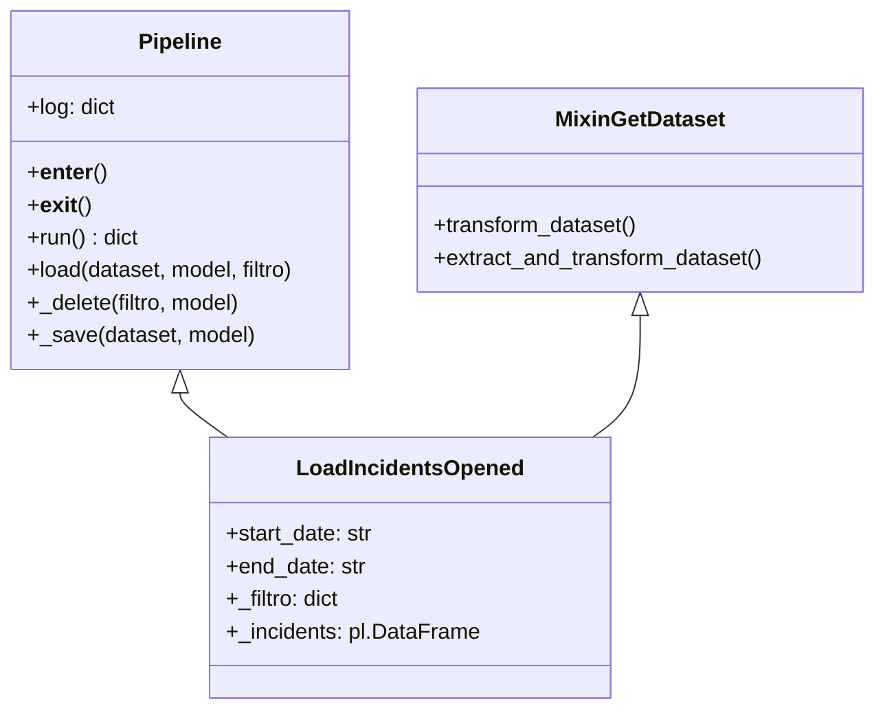

# Tasks

## Visão Geral

As tasks do `api_service_now_new` implementam o padrão Pipeline para extrair, transformar e carregar dados do ServiceNow. Cada task herda funcionalidades base e implementa sua própria lógica de extração específica.

## Arquitetura Base

### Hierarquia de Classes



### Padrão Comum

Todas as tasks seguem o mesmo padrão estrutural:

```python
class LoadExampleTask(MixinGetDataset, Pipeline):
    def __init__(self, start_date=None, end_date=None):
        self.start_date = start_date
        self.end_date = end_date
        super().__init__()

    @property
    def _filtro(self) -> dict:
        # Filtro para delete/upsert no banco
        return {...}

    def run(self) -> Dict:
        self.extract_and_transform_dataset()
        self.load(dataset=self.dataset, model=Model, filtro=self._filtro)
        return self.log

    def extract_and_transform_dataset(self) -> None:
        self.dataset = self._data_property

    @property 
    def _data_property(self) -> pl.DataFrame:
        # Lógica de extração via API ServiceNow
        return pl.DataFrame(...)
```

## Tasks de Incidents

### LoadIncidentsOpened

**Propósito**: Carrega incidents abertos no período especificado

**Parâmetros**:
- `start_date`: Data de início (YYYY-MM-DD)
- `end_date`: Data de fim (YYYY-MM-DD)

**Filtro ServiceNow**: `opened_at >= start_date AND opened_at <= end_date`

**Query Adicional**: `assignment_groupLIKEvita` (filtra apenas filas Vita)

**Modelo**: `Incident`

```python
# Exemplo de uso
task = LoadIncidentsOpened(start_date="2025-01-20", end_date="2025-01-20")
with task as loader:
    result = loader.run()
    print(f"Inseridos: {result['n_inserted']} incidents")
```

### LoadIncidentSla

**Propósito**: Carrega SLAs dos incidents no período

**Parâmetros**:
- `start_date`: Data de início 
- `end_date`: Data de fim

**Filtro ServiceNow**: `sys_created_on >= start_date AND sys_created_on <= end_date`

**Query Adicional**: `task.assignment_group.nameLIKEvita` (dot-walk para fila)

**Modelo**: `IncidentSla`

**Características Especiais**:
- Usa dot-walk para filtrar por assignment group do incident relacionado
- Filtra apenas SLAs com task não vazia: `taskISNOTEMPTY`

### LoadIncidentTask

**Propósito**: Carrega tasks relacionadas aos incidents

**Parâmetros**:
- `start_date`: Data de início
- `end_date`: Data de fim  

**Filtro ServiceNow**: `sys_created_on >= start_date AND sys_created_on <= end_date`

**Query Adicional**: `assignment_groupLIKEvita`

**Modelo**: `IncidentTask`

### LoadTaskTimeWorked

**Propósito**: Carrega registros de tempo trabalhado nas tasks

**Parâmetros**:
- `start_date`: Data de início
- `end_date`: Data de fim

**Filtro ServiceNow**: `sys_created_on >= start_date AND sys_created_on <= end_date`

**Modelo**: `TaskTimeWorked`

**Características**:
- Captura tempo gasto em cada task
- Essencial para análise de produtividade

## Tasks de Configurações

### LoadGroups

**Propósito**: Carrega grupos de atribuição do ServiceNow

**Parâmetros**: Nenhum (dados relativamente estáticos)

**Query**: `nameLIKEvita` (apenas grupos Vita)

**Modelo**: `Groups`

**Método de Carga**: `upsert_by_sys_id()` ao invés de delete/insert

```python
def run(self) -> Dict:
    self.extract_and_transform_dataset()
    # Usa upsert ao invés de delete/insert
    upsert_by_sys_id(dataset=self.dataset, model=Groups, log=self.log)
    return self.log
```

### LoadSysUser

**Propósito**: Carrega usuários do sistema

**Parâmetros**: Nenhum

**Query**: Filtros específicos para usuários ativos

**Modelo**: `SysUser`

**Método de Carga**: `upsert_by_sys_id()`

### LoadSysCompany

**Propósito**: Carrega empresas cadastradas

**Parâmetros**: Nenhum

**Modelo**: `SysCompany`

**Método de Carga**: `upsert_by_sys_id()`

### LoadContractSla

**Propósito**: Carrega definições de contratos SLA

**Parâmetros**: Nenhum

**Modelo**: `ContractSla` 

**Método de Carga**: `upsert_by_sys_id()`

### LoadCmdbCiNetworkLink

**Propósito**: Carrega links de rede do CMDB

**Parâmetros**: Nenhum

**Modelo**: `CmdbCiNetworkLink`

**Método de Carga**: `upsert_by_sys_id()`

## Tasks de Atualização (Desabilitadas)

### LoadIncidentsUpdated

**Status**: Comentado no código

**Propósito**: Atualizaria incidents modificados

**Razão da Desabilitação**: Performance e complexidade

### LoadIncidentSlaUpdated

**Status**: Comentado no código

**Propósito**: Atualizaria SLAs modificados

### LoadIncidentTaskUpdated

**Status**: Comentado no código

**Propósito**: Atualizaria tasks modificadas

## Estratégias de Carga

### Delete/Insert (Tasks de Incidents)

Usado para dados que mudam frequentemente:

```python
@transaction.atomic
def load(self, dataset: pl.DataFrame, model: models.Model, filtro: dict) -> None:
    self._delete(filtro=filtro, model=model)  # Remove dados antigos
    self._save(dataset=dataset, model=model)   # Insere novos dados
```

**Vantagens**:
- Garante consistência total
- Remove dados órfãos
- Simples de implementar

**Desvantagens**:
- Perde histórico de timestamps ETL
- Mais lento para grandes volumes

### Upsert (Tasks de Configurações)

Usado para dados relativamente estáticos:

```python
@transaction.atomic
def upsert_by_sys_id(dataset: pl.DataFrame, model, log: Dict = None) -> None:
    # Separa registros existentes dos novos
    existing = {o.sys_id: o for o in model.objects.filter(sys_id__in=[...])}
    
    to_create = []  # Novos registros
    to_update = []  # Registros existentes
    
    # Executa em lote
    model.objects.bulk_create(to_create, batch_size=1000)
    model.objects.bulk_update(to_update, update_fields, batch_size=1000)
```

**Vantagens**:
- Preserva timestamps ETL
- Mais eficiente para dados estáticos
- Mantém histórico

**Desvantagens**:
- Mais complexo
- Não remove registros órfãos

## Extração de Dados

### Paginação ServiceNow

Todas as tasks usam paginação offset-based:

```python
result_list = paginate(
    path="incident",              # Endpoint da API
    params={
        "sysparm_query": query,   # Filtros
        "sysparm_fields": fields, # Campos desejados
    },
    mode="offset",
    limit_param="sysparm_limit",
    offset_param="sysparm_offset", 
    result_key="result",
)
```

### Filtragem de Campos

Extrai apenas campos definidos no modelo:

```python
fields = ",".join([
    f.name for f in Model._meta.fields 
    if not f.name.startswith("etl_") and f.name != "etl_hash"
])
```

### Tratamento de Referências

Campos de referência são automaticamente expandidos:

```python
# API retorna: {"manager": {"value": "abc123", "display_value": "João Silva"}}
# Após processamento: 
# {"manager": "abc123", "dv_manager": "João Silva"}
```

## Sistema de Logging

### Log Base (Pipeline)

```python
self.log = {
    "n_inserted": 0,        # Registros inseridos
    "n_deleted": 0,         # Registros deletados  
    "started_at": ...,      # Timestamp início
    "finished_at": ...,     # Timestamp fim
    "duration": ...,        # Duração total (segundos)
    "delete_duration": ..., # Tempo de delete
    "save_duration": ...,   # Tempo de save
    "load_duration": ...    # Tempo total de load
}
```

### Context Manager

Tasks implementam context manager para log automático:

```python
def __enter__(self):
    return self

def __exit__(self, exc_type, exc_value, traceback):
    self.log["finished_at"] = timezone.now()
    self.log["duration"] = round(
        (self.log["finished_at"] - self.log["started_at"]).total_seconds(), 2
    )
```

### Exemplo de Log

```json
{
  "n_inserted": 1250,
  "n_deleted": 1180,
  "started_at": "2025-01-20T10:00:00Z",
  "finished_at": "2025-01-20T10:03:45Z", 
  "duration": 225.67,
  "delete_duration": 12.34,
  "save_duration": 189.23,
  "load_duration": 201.57
}
```

## Integração Celery

### Tasks Async Disponíveis

Cada task possui wrapper Celery para execução assíncrona:

```python
@shared_task(
    name="api_service_now_new.load_incidents_opened_async",
    bind=True,
    autoretry_for=(Exception,),
    retry_backoff=5,
    retry_kwargs={"max_retries": 3},
)
def load_incidents_opened_async(_task, start_date: str, end_date: str):
    sync_task = LoadIncidentsOpened(start_date=start_date, end_date=end_date)
    return sync_task.run()
```

### Uso Atual

As views usam threading ao invés de Celery:

```python
# Chamada direta (não async)
with task_cls(start_date=start_date, end_date=end_date) as load:
    r = load.run()
```

## Performance

### Otimizações Implementadas

1. **Polars DataFrame**: Processamento eficiente de dados
2. **Bulk Operations**: Inserções em lote (1000 registros)
3. **Field Selection**: Apenas campos necessários da API
4. **Paginação**: Chunks de 10.000 registros
5. **Transaction Atomic**: Garante consistência

### Métricas por Task

| Task | Volume Médio | Tempo Médio | Estratégia |
|------|-------------|-------------|------------|
| LoadIncidentsOpened | 1.000-5.000 | 2-5 min | Delete/Insert |
| LoadIncidentSla | 2.000-10.000 | 3-8 min | Delete/Insert |
| LoadGroups | 50-200 | 10-30s | Upsert |
| LoadSysUser | 1.000-3.000 | 1-3 min | Upsert |

### Gargalos Identificados

1. **API ServiceNow**: Rate limiting e latência
2. **Network**: Transferência de grandes volumes
3. **Database**: Operações de delete em massa
4. **Memory**: DataFrames grandes em memória

## Tratamento de Erros

### Nível de Task

```python
try:
    with task_cls(start_date=start_date, end_date=end_date) as load:
        r = load.run()
    results[task_name] = r
    logger.info("%s finished: %s", task_name, r)
except Exception as e:
    logger.exception("Erro na task %s", task_name)
    errors.append((task_name, str(e)))
```

### Nível de Pipeline

```python
@transaction.atomic
def load(self, dataset, model, filtro):
    try:
        self._delete(filtro=filtro, model=model)
        self._save(dataset=dataset, model=model)
    except Exception:
        # Rollback automático devido ao decorator
        raise
```

### Nível de API

```python
if resp.status_code != 200:
    raise RuntimeError(f"API error: {resp.status_code} - {resp.text}")
```

## Extensibilidade

### Nova Task de Incident

```python
class LoadNewIncidentData(MixinGetDataset, Pipeline):
    def __init__(self, start_date: str, end_date: str):
        self.start_date = start_date
        self.end_date = end_date
        super().__init__()

    @property
    def _filtro(self) -> dict:
        return {
            "sys_created_on__gte": ensure_datetime(self.start_date, end=False),
            "sys_created_on__lte": ensure_datetime(self.end_date, end=True),
        }

    def run(self) -> Dict:
        self.extract_and_transform_dataset()
        self.load(dataset=self.dataset, model=NewModel, filtro=self._filtro)
        return self.log

    def extract_and_transform_dataset(self) -> None:
        self.dataset = self._new_data

    @property
    def _new_data(self) -> pl.DataFrame:
        # Implementar extração específica
        pass
```

### Nova Task de Configuração

```python
class LoadNewConfig(MixinGetDataset, Pipeline):
    def __init__(self):
        super().__init__()

    def run(self) -> Dict:
        self.extract_and_transform_dataset()
        upsert_by_sys_id(dataset=self.dataset, model=NewConfigModel, log=self.log)
        return self.log
```

## Monitoramento

### Métricas Chave

1. **Taxa de Sucesso**: Execuções sem erro / Total execuções
2. **Tempo Médio**: Por task e por período
3. **Volume de Dados**: Registros processados por execução
4. **Eficiência**: Registros por segundo

### Alertas Recomendados

1. **Duração Excessiva**: Task > 15 minutos
2. **Taxa de Erro**: > 5% em 24h
3. **Volume Zero**: Nenhum registro processado
4. **API Timeout**: Falhas de conectividade

### Consultas Úteis

```python
# Última execução por task
from api_service_now_new.models import ServiceNowExecutionLog

recent_executions = ServiceNowExecutionLog.objects.filter(
    execution_type='incidents'
).order_by('-started_at')[:5]

# Tempo médio por tipo
avg_duration = ServiceNowExecutionLog.objects.filter(
    status='success'
).aggregate(
    avg_incidents=Avg(Case(When(execution_type='incidents', then='duration_seconds'))),
    avg_configs=Avg(Case(When(execution_type='configurations', then='duration_seconds')))
)
```

## Tasks Detalhadas

### Tasks de Incidents (com período)
- [LoadIncidentsOpened](load_incidents_opened.md) - Carrega incidents abertos no período
- [LoadIncidentSla](load_incident_sla.md) - Carrega SLAs dos incidents
- [LoadIncidentTask](load_incident_task.md) - Carrega tasks relacionadas aos incidents
- [LoadTaskTimeWorked](load_task_time_worked.md) - Carrega tempo trabalhado nas tasks

### Tasks de Configurações (sem período)
- [LoadContractSla](load_contract_sla.md) - Carrega contratos SLA
- [LoadGroups](load_groups.md) - Carrega grupos de atribuição
- [LoadSysUser](load_sys_user.md) - Carrega usuários (estratégia inteligente)
- [LoadSysCompany](load_sys_company.md) - Carrega empresas
- [LoadCmdbCiNetworkLink](load_cmdb_ci_network_link.md) - Carrega links de rede CMDB

### Tasks de Atualização (Desabilitadas)
- [LoadIncidentsUpdated](load_incidents_updated.md) - Atualiza incidents modificados
- [LoadIncidentSlaUpdated](load_incident_sla_updated.md) - Atualiza SLAs modificados  
- [LoadIncidentTaskUpdated](load_incident_task_updated.md) - Atualiza tasks modificadas