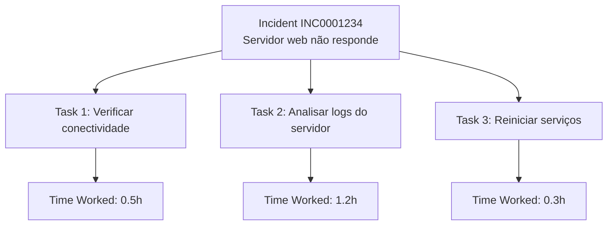

# LoadIncidentTask

## Visão Geral

A task `LoadIncidentTask` extrai tasks relacionadas aos incidents do ServiceNow. Tasks são subtarefas criadas para resolver um incident principal, permitindo divisão de trabalho e tracking granular de atividades.

## Características

- **Tipo**: Task de Incidents (com período)
- **Modelo**: `IncidentTask`
- **Filtro Principal**: `sys_created_on` (data de criação da task)
- **Estratégia de Carga**: DELETE + INSERT (transacional)
- **Relacionamento**: Conecta com `Incident` via campo `parent`

## Implementação

### Classe Principal

```python
class LoadIncidentTask(MixinGetDataset, Pipeline):
    def __init__(self, start_date: str, end_date: str):
        self.start_date = start_date  # YYYY-MM-DD
        self.end_date = end_date      # YYYY-MM-DD
        super().__init__()
```

### Query ServiceNow

```python
query = f"sys_created_on>={self.start_date} 00:00:00^sys_created_on<={self.end_date} 23:59:59"
add_q = "assignment_groupSTARTSWITHvita"
query = f"{query}^{add_q}"
```

**Componentes**:
1. `sys_created_on>=2025-01-20 00:00:00` - Data início
2. `sys_created_on<=2025-01-20 23:59:59` - Data fim
3. `assignment_groupLIKEvita` - Apenas tasks do grupo Vita

**Diferença do LoadIncidentSla**: Não usa dot-walk, filtra diretamente por assignment_group da task.

## Estrutura de Dados

### Campos Principais

O modelo `IncidentTask` inclui:

**Identificação**:
- `sys_id` (PK) - ID único da task
- `number` - Número sequencial (ex: TASK0001234)
- `parent` - Referência ao incident pai (sys_id)

**Status**:
- `state` - Estado da task (1=New, 2=In Progress, 3=Resolved, etc.)
- `active` - Task ativa (true/false)
- `priority` - Prioridade da task

**Atribuição**:
- `assignment_group` - Grupo responsável
- `assigned_to` - Usuário atribuído
- `opened_by` - Quem criou a task

**Conteúdo**:
- `short_description` - Descrição breve
- `description` - Descrição completa
- `work_notes` - Notas de trabalho

**Temporização**:
- `opened_at` - Data/hora de abertura
- `closed_at` - Data/hora de fechamento
- `due_date` - Data limite

### Exemplo de Task

```json
{
  "sys_id": "task789xyz",
  "number": "TASK0001234",
  "parent": "inc456def", 
  "state": "2",
  "active": "true",
  "assignment_group": "grp123abc",
  "assigned_to": "user456def",
  "short_description": "Configurar firewall para novo servidor",
  "description": "Configurar regras de firewall para permitir acesso ao servidor web conforme especificação...",
  "opened_at": "2025-01-20 09:15:00",
  "due_date": "2025-01-22 17:00:00",
  "priority": "3"
}
```

## Relacionamentos

### Com Incidents (Parent)

```python
# Buscar incident pai da task
task = IncidentTask.objects.get(number="TASK0001234")
parent_incident = Incident.objects.get(sys_id=task.parent)

print(f"Task {task.number} pertence ao incident {parent_incident.number}")

# Buscar todas as tasks de um incident
incident = Incident.objects.get(number="INC0001234")
related_tasks = IncidentTask.objects.filter(parent=incident.sys_id)

print(f"Incident {incident.number} tem {related_tasks.count()} tasks")
```

### Com Time Worked

```python
# Tasks podem ter registros de tempo trabalhado
from api_service_now_new.models import TaskTimeWorked

task = IncidentTask.objects.get(number="TASK0001234")
time_records = TaskTimeWorked.objects.filter(task=task.sys_id)

total_time = sum([
    float(record.time_spent or 0) 
    for record in time_records
])

print(f"Tempo total trabalhado na task: {total_time} horas")
```

## Hierarquia de Trabalho

### Estrutura Típica



### Estados das Tasks

| Estado | Valor | Descrição |
|--------|-------|-----------|
| New | 1 | Task criada, aguardando início |
| In Progress | 2 | Task em andamento |
| Resolved | 3 | Task resolvida |
| Closed | 7 | Task fechada |
| Canceled | 8 | Task cancelada |

## Performance

### Métricas Típicas

| Métrica | Valor Típico | Observações |
|---------|--------------|-------------|
| **Volume Diário** | 800-3000 tasks | ~1.5-3x o número de incidents |
| **Tempo Médio** | 2-6 minutos | Depende do volume |
| **Ratio Task/Incident** | 1.5-3.0 | Incidents complexos geram mais tasks |

### Query Performance

A query é mais simples que LoadIncidentSla (sem dot-walk):

```python
# ✅ Performance boa: Filtro direto
"sys_created_on>=2025-01-20^assignment_groupLIKEvita"

# vs LoadIncidentSla (mais lento)
"sys_created_on>=2025-01-20^task.assignment_group.nameLIKEvita"
```

## Análises Possíveis

### Distribuição de Tasks por Incident

```python
from django.db.models import Count

# Incidents com mais tasks
incidents_with_tasks = IncidentTask.objects.values('parent').annotate(
    task_count=Count('sys_id')
).order_by('-task_count')[:10]

for item in incidents_with_tasks:
    incident = Incident.objects.get(sys_id=item['parent'])
    print(f"{incident.number}: {item['task_count']} tasks")
```

### Produtividade por Grupo

```python
from django.db.models import Avg, Count
from django.db import connection

query = """
SELECT 
    t.assignment_group,
    g.name as group_name,
    COUNT(*) as total_tasks,
    COUNT(CASE WHEN t.state IN ('3', '7') THEN 1 END) as completed_tasks,
    AVG(
        CASE 
            WHEN t.closed_at IS NOT NULL AND t.opened_at IS NOT NULL
            THEN EXTRACT(epoch FROM (t.closed_at::timestamp - t.opened_at::timestamp))/3600
        END
    ) as avg_resolution_hours
FROM incident_task t
LEFT JOIN groups g ON t.assignment_group = g.sys_id
WHERE t.sys_created_on::date = %s
GROUP BY t.assignment_group, g.name
ORDER BY total_tasks DESC
"""

with connection.cursor() as cursor:
    cursor.execute(query, ['2025-01-20'])
    results = cursor.fetchall()
```

### Tasks Atrasadas

```python
from django.utils import timezone

# Tasks com due_date vencido e ainda abertas
overdue_tasks = IncidentTask.objects.filter(
    due_date__lt=timezone.now(),
    state__in=['1', '2'],  # New ou In Progress
    active='true'
)

print(f"Tasks atrasadas: {overdue_tasks.count()}")

# Agrupa por assignment_group
from collections import defaultdict
overdue_by_group = defaultdict(int)

for task in overdue_tasks:
    overdue_by_group[task.assignment_group] += 1
```

## Execução

### Standalone

```python
task = LoadIncidentTask(
    start_date="2025-01-20",
    end_date="2025-01-20"
)

with task as loader:
    result = loader.run()
    
print(f"Tasks processadas: {result['n_inserted']}")
print(f"Tasks removidas: {result['n_deleted']}")
print(f"Duração: {result['duration']}s")
```

### Threading (Paralelo)

Executa junto com outras tasks de incidents:

```python
heavy_tasks = [
    ("load_incidents_opened", LoadIncidentsOpened),
    ("load_incident_sla", LoadIncidentSla), 
    ("load_task_time_worked", LoadTaskTimeWorked),
    ("load_incident_task", LoadIncidentTask),  # Esta task
]

# 4 threads paralelas
for name, cls in heavy_tasks:
    thread = threading.Thread(
        target=execute_task,
        args=(name, cls, start_date, end_date),
        daemon=True
    )
    thread.start()
    threads.append(thread)
```

## Monitoramento

### KPIs de Tasks

```python
from datetime import date
from django.db.models import Count, Avg, Q

today = date.today()

metrics = {
    # Volume
    'tasks_created': IncidentTask.objects.filter(
        sys_created_on__date=today
    ).count(),
    
    # Status distribution
    'new_tasks': IncidentTask.objects.filter(
        sys_created_on__date=today, state='1'
    ).count(),
    
    'in_progress': IncidentTask.objects.filter(
        sys_created_on__date=today, state='2'  
    ).count(),
    
    'completed': IncidentTask.objects.filter(
        sys_created_on__date=today, state__in=['3', '7']
    ).count(),
    
    # Tempo médio de resolução (tasks fechadas)
    'avg_resolution_time': IncidentTask.objects.filter(
        sys_created_on__date=today,
        closed_at__isnull=False,
        opened_at__isnull=False
    ).extra(
        select={'resolution_hours': 
            "EXTRACT(epoch FROM (closed_at::timestamp - opened_at::timestamp))/3600"
        }
    ).aggregate(avg=Avg('resolution_hours'))['avg']
}

# Taxa de conclusão
completion_rate = (metrics['completed'] / metrics['tasks_created'] * 100 
                  if metrics['tasks_created'] > 0 else 0)
```

### Alertas de Negócio

```python
# Alerta: muitas tasks abertas vs fechadas
open_tasks = metrics['new_tasks'] + metrics['in_progress']
if open_tasks > metrics['completed']:
    send_alert(f"Backlog de tasks crescendo: {open_tasks} abertas vs {metrics['completed']} fechadas")

# Alerta: tempo médio de resolução alto
if metrics['avg_resolution_time'] and metrics['avg_resolution_time'] > 24:
    send_alert(f"Tempo médio de resolução alto: {metrics['avg_resolution_time']:.1f}h")
```

## Integração com Outras Tasks

### Dependências de Dados

```python
# 1. LoadIncidentsOpened deve executar ANTES
# Para garantir que incidents pais existam

# 2. LoadTaskTimeWorked pode executar EM PARALELO
# Tasks e time_worked são independentes

# 3. LoadIncidentTask usado por análises posteriores
# Dashboards e relatórios dependem destes dados
```

### Validação de Integridade

```python
def validate_task_integrity():
    """Verifica se todas as tasks têm incident pai válido"""
    
    orphan_tasks = IncidentTask.objects.extra(
        where=["parent NOT IN (SELECT sys_id FROM incident)"]
    )
    
    if orphan_tasks.exists():
        logger.warning(f"Tasks órfãs encontradas: {orphan_tasks.count()}")
        
        # Opcional: remover tasks órfãs
        # orphan_tasks.delete()
    
    return orphan_tasks.count()
```

## Troubleshooting

### Problemas Comuns

**1. Tasks órfãs**
```
Situação: Task.parent não existe em Incident
Causa: Incident foi deletado mas task permanece
Solução: Executar LoadIncidentsOpened primeiro
```

**2. Volume inesperadamente alto**
```
Situação: 10x mais tasks que incidents
Causa: Possível mudança no processo ServiceNow
Investigação: Verificar se filtros estão corretos
```

**3. Estados inconsistentes**
```
Situação: Task state='3' mas active='true'  
Causa: Dados inconsistentes no ServiceNow
Solução: Reportar ao time ServiceNow
```

### Debug

```python
# Verificar amostra de dados
sample_tasks = IncidentTask.objects.filter(
    sys_created_on__date='2025-01-20'
)[:5]

for task in sample_tasks:
    parent_exists = Incident.objects.filter(sys_id=task.parent).exists()
    print(f"Task {task.number}: Parent exists = {parent_exists}")
    
    if not parent_exists:
        print(f"  Orphan task - parent sys_id: {task.parent}")
```

Esta task é fundamental para análises de produtividade e tracking detalhado de atividades de resolução de incidents.